<!-- ============================================ -->
<!--  SARANSH • GITHUB PROFILE                    -->
<!--  animated ascii terminal · light/dark aware  -->
<!-- ============================================ -->

<div align="center">

<picture>
  <source media="(prefers-color-scheme: dark)" srcset="./assets/header-dark.svg">
  <source media="(prefers-color-scheme: light)" srcset="./assets/header-light.svg">
  
</picture>

<picture>
  <source media="(prefers-color-scheme: dark)" srcset="https://readme-typing-svg.demolab.com/?font=JetBrains+Mono&weight=500&size=17&duration=2400&pause=900&color=FFFFFF&center=true&vCenter=true&width=620&height=44&lines=Full-Stack+Web+Developer+%40+What+Works+Global;API-first+systems+%C2%B7+headless+CMS+%C2%B7+data-heavy+apps;Clean+systems.+Thoughtful+UI.+Things+that+get+used.">
  <source media="(prefers-color-scheme: light)" srcset="https://readme-typing-svg.demolab.com/?font=JetBrains+Mono&weight=500&size=17&duration=2400&pause=900&color=111111&center=true&vCenter=true&width=620&height=44&lines=Full-Stack+Web+Developer+%40+What+Works+Global;API-first+systems+%C2%B7+headless+CMS+%C2%B7+data-heavy+apps;Clean+systems.+Thoughtful+UI.+Things+that+get+used.">
  
</picture>

<picture>
  <source media="(prefers-color-scheme: dark)" srcset="./assets/ascii-dark.svg">
  <source media="(prefers-color-scheme: light)" srcset="./assets/ascii-light.svg">
  
</picture>


</div>

## `~ $ whoami`

```ts
const saransh = {
  role:      "Full-Stack Web Developer",
  company:   "What Works Global",          // whatworks.com.au
  education: "University of Canberra",
  domains:   ["government", "defence", "startup", "enterprise"],
  focus:     ["API-first systems", "headless CMS", "data-heavy apps"],
  belief:    "build things that actually get used",
};
```

I work across the stack — from frontend performance and UX to backend
architecture, CMS design, and cloud deployments. I like clean systems
and thoughtful UI.

<div align="center"></div>

## `~ $ cat stack.txt`

**Frontend**


**Backend & CMS**


**Databases**


**Cloud, DevOps & Design**


<div align="center"></div>

## `~ $ ls projects/`

<table>
<tr>
<td width="50%" valign="top">

### 🛰️ Unitracker
**Next.js · Payload CMS · d3.js**

Research & analytics platform with interactive data visualisation on a headless CMS architecture.

🔗 [unitracker.aspi.org.au](https://unitracker.aspi.org.au/)

</td>
<td width="50%" valign="top">

### 🔐 Allyone
**Django · React · PostgreSQL**

A secure, data-centric platform built for structured workflows and reliability at scale.

🔗 [allyone.com.au](https://allyone.com.au/)

</td>
</tr>
<tr>
<td width="50%" valign="top">

### 🌋 VMGD — Vanuatu Met & Geo-Hazards
**WordPress · React · GraphQL**

National platform delivering real-time weather warnings and disaster advisories, built for public accessibility and rapid updates.

🔗 [vmgd.gov.vu](https://www.vmgd.gov.vu/)

</td>
<td width="50%" valign="top">

### 🎨 Creative Builds
**Next.js · Payload · Relume · Webflow**

Content-driven and marketing platforms with custom CMS pipelines and performance-focused builds.

🔗 [himayat.com.au](https://www.himayat.com.au/) · [cogitogroup.net](https://cogitogroup.net/) · [securesme.com](https://securesme.com/) · [training.cogitogroup.net](https://training.cogitogroup.net/) · [x-rd.com.au](https://www.x-rd.com.au/) · [secd3v.com.au](https://www.secd3v.com.au/) · [cbrin.com.au](https://cbrin.com.au/) · [fivebridges.org.au](https://fivebridges.org.au/) · [bittn.com.au](https://bittn.com.au/) · [recordtime.com.au](https://recordtime.com.au/) · [ngamuru.com](https://ngamuru.com/)

</td>
</tr>
<tr>
<td width="50%" valign="top">

### ♿ Australian Medical Council
**Accessibility · WCAG · Multilingual**

Enhanced the AMC website through accessibility upgrades, navigation improvements, multilingual integration, and front-end refinements — WCAG-focused fixes with improved screen reader support.

🔗 [amc.org.au](https://www.amc.org.au/)

</td>
<td width="50%" valign="top">

### 🧩 HAAST
**Figma Plugin · Marketing Compliance**

Developed a Figma plugin for marketing compliance, bringing automated brand and regulatory checks directly into the design workflow.

🔗 [haast.io](https://haast.io/)

</td>
</tr>
</table>

<div align="center"></div>

## `~ $ git log --stat`

<div align="center">

<picture>
  <source media="(prefers-color-scheme: dark)" srcset="https://github-readme-stats.vercel.app/api?username=saransh-100&show_icons=true&hide_border=true&bg_color=00000000&title_color=FFFFFF&icon_color=B3B3B3&text_color=8A8A8A&ring_color=FFFFFF">
  <source media="(prefers-color-scheme: light)" srcset="https://github-readme-stats.vercel.app/api?username=saransh-100&show_icons=true&hide_border=true&bg_color=00000000&title_color=111111&icon_color=3D3D3D&text_color=5C5C5C&ring_color=111111">
  
</picture>
<picture>
  <source media="(prefers-color-scheme: dark)" srcset="https://streak-stats.demolab.com?user=saransh-100&hide_border=true&background=00000000&ring=FFFFFF&fire=E0E0E0&currStreakNum=F5F5F5&sideNums=F5F5F5&currStreakLabel=FFFFFF&sideLabels=B3B3B3&dates=5C5C5C&stroke=00000000">
  <source media="(prefers-color-scheme: light)" srcset="https://streak-stats.demolab.com?user=saransh-100&hide_border=true&background=00000000&ring=111111&fire=2B2B2B&currStreakNum=111111&sideNums=111111&currStreakLabel=111111&sideLabels=3D3D3D&dates=A3A3A3&stroke=00000000">
  
</picture>

<br/><br/>

<picture>
  <source media="(prefers-color-scheme: dark)" srcset="./assets/contributions-dark.svg">
  <source media="(prefers-color-scheme: light)" srcset="./assets/contributions-light.svg">
  
</picture>

</div>

<div align="center"></div>

## `~ $ ping saransh`

<div align="center">

[](https://saransh.com.au/)
[](https://www.linkedin.com/in/saransh-kharel-710844231/)

<br/>

```text
 ┌───────────────────────────────────────────────┐
 │  🎮 gaming   💻 side projects   🏃 running     │
 │  📚 reading                                   │
 │                                               │
 │  > thanks for stopping by_                    │
 └───────────────────────────────────────────────┘
```

</div>
